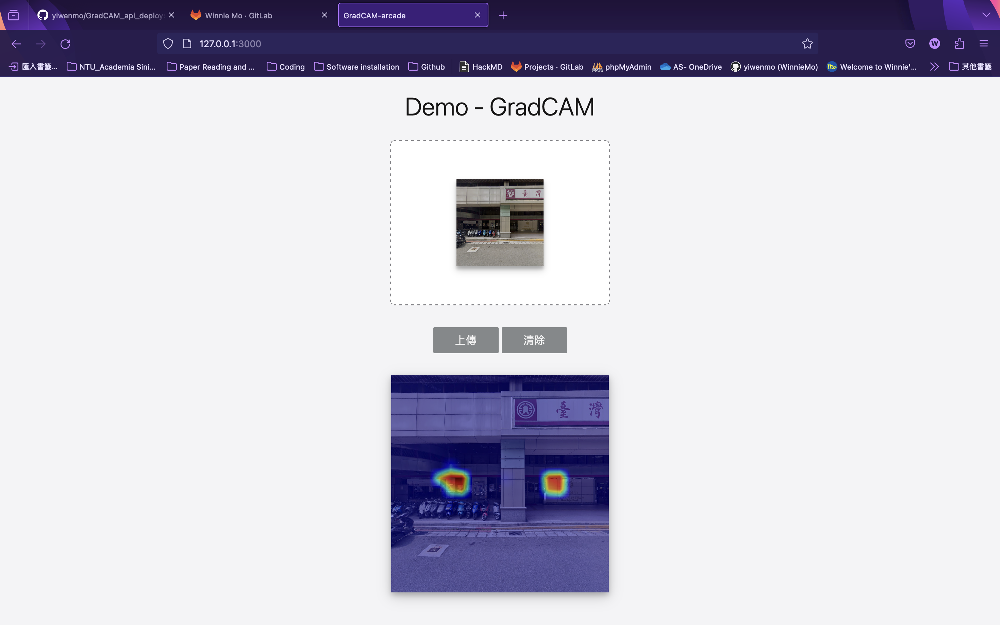
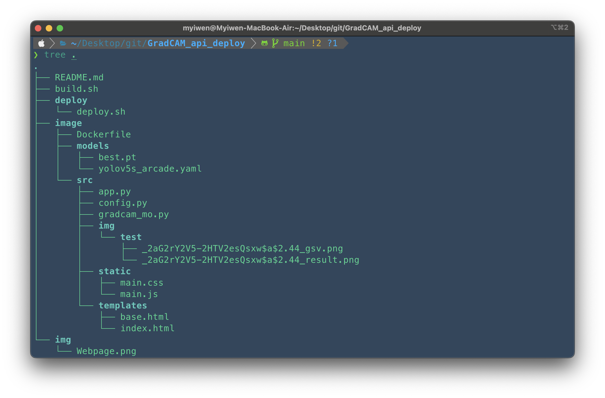

# GradCAM_api_deploy
Utilized a pretrained YOLOv5 arcade model on Google Street View images, creating GradCAM heatmaps for object detection insights. This allows the visualization of key areas impacting model predictions, aiding in spatial analysis.



## Operation Flow
Execute `build.sh`

```
bash build.sh
```
The contents of this file can create an image and container at once:
```
#!/bin/bash
docker build -t <image_name:image_tag> <Dockerfile存放的dir>
docker run -it --rm -p 5000:5000 --name <container_name> <image_name:image_tag>
```

For example:
```
#!/bin/bash
docker build -t gradcam image
docker run -it --rm -p 5000:5000 --name test_demo gradcam
```

## Folder Structure


## Data Explanation
- build.sh：Run bash `build.sh` to easily create both image and container.

- .gitignore : Ignore the contents of this file when uploading to Git.


**image Folder Explanation**
- Dockerfile：Builds the Docker image, including the basic Python environment, necessary file copies, and package installations.


- models/:
    - yolov5s_arcade.yaml: YOLOv5 arcade model architecture file.
    - best.pt：Pre-trained weights file for the YOLOv5 model.


- src/:
    - `app.py`： Main Flask application code.
    - `config.py`: To simplify the `app.py` file, input and output folder paths and necessary functions are defined in `config.py`. Imported into `app.py` using `from config`.
    - img/:
        - test/:Used to test the updated Dockerfile and confirm proper functioning without Flask mode.
    - gradcam_mo.py：Executes GradCAM code.
    - static/：Stores static data such as CSS, JavaScript files, etc.
    - templates/：HTML templates are stored in this folder.